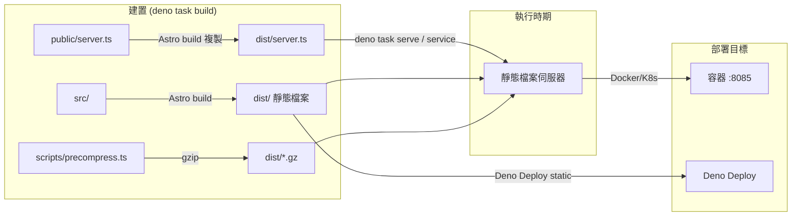

本部落格的架構
===

[回專案主頁](.././README.md)

## 技術

- Deno: 2.9.x
- Astro.js: 7.1.x
- Pagefind（搜尋索引）: 1.5.x
- 部署：
  - Deno Deploy（static mode，`./dist/`）
  - 容器（Docker / Kubernetes）：以 `dist/server.ts` 提供靜態檔案服務

## 部署架構

### 靜態檔案伺服器（server.ts）

- 原始碼位於 `public/server.ts`，隨 Astro build 複製至 `dist/server.ts`
  * `server.ts` 隨 `public/` 被 Astro 打包進 `dist/`，因此以腳本所在目錄為服務根目錄
- 服務根目錄
  * 以 `import.meta.dirname` 決定（即 `dist/`）
  * 不依賴啟動時的命令列指令
- 功能：
  - 安全性標頭（CSP、HSTS、X-Frame-Options 等）
  - 分層快取策略（`/_astro/` immutable、靜態資源 7 天、HTML no-cache）
  - 預壓縮變體支援（`.br` / `.gz`，依 `Accept-Encoding` 挑選）
  - 目錄穿越防護與 404 頁面處理
- 靜態部署（Deno Deploy）的快取規則由 `public/_headers` 定義，與 server.ts 對應

## 主題

- [`satnaing/astro-paper`](https://github.com/satnaing/astro-paper)
  > Made with 🤍 by [Sat Naing](https://satnaing.dev) 👨🏻‍💻 and
  > [contributors](https://github.com/satnaing/astro-paper/graphs/contributors).
