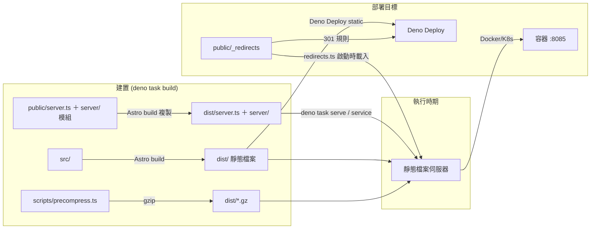

本部落格的架構
===

[回專案主頁](.././README.md)

## 技術

- Deno: 2.9.x
- Astro.js: 7.3.x
- Pagefind（搜尋索引）: 1.5.x
- 部署：
  - Deno Deploy（static mode，`./dist/`）
  - 容器（Docker / Kubernetes）：以 `dist/server.ts` 提供靜態檔案服務

## 部署架構

```mermaid
flowchart LR
    subgraph Build["建置 (deno task build)"]
        A[public/server.ts ＋ server/ 模組] -->|Astro build 複製| D[dist/server.ts ＋ server/]
        S[src/] -->|Astro build| D2[dist/ 靜態檔案]
        P[scripts/precompress.ts] -->|gzip| D3[dist/*.gz]
    end

    subgraph Runtime["執行時期"]
        D -->|deno task serve / service| S1[靜態檔案伺服器]
        D2 --> S1
        D3 --> S1
    end

    subgraph Deploy["部署目標"]
        S1 -->|Docker/K8s| C1[容器 :8085]
        D2 -->|Deno Deploy static| C2[Deno Deploy]
        R[public/_redirects] -->|301 規則| C2
        R -->|redirects.ts 啟動時載入| S1
    end
```

### 靜態檔案伺服器（server.ts ＋ server/ 模組）

- 入口 `public/server.ts` 只讀環境變數、組 `ServerContext`、啟動 `Deno.serve`；
  邏輯在 `public/server/` 各模組，隨 Astro build 一併複製至 `dist/server/`
  - `config.ts`：常數（快取、安全標頭）與 `LOG_FORMAT` 解析
  - `security.ts` / `cache.ts`：安全標頭附加、Cache-Control 決策
  - `fs.ts`：存在檢查、防目錄遍歷路徑解析
  - `redirects.ts`：`_redirects` 載入
  - `compression.ts`：br/gzip 協商（RFC 9110 §12.5.3）
  - `logging.ts`：access log（text/JSON）
  - `handler.ts`：靜態服務內層＋log 外層、`ServerContext`
- 服務根目錄
  - 以 `import.meta.dirname` 決定（即 `dist/`）
  - 不依賴啟動時的命令列指令
- 功能：
  - 安全性標頭（CSP、HSTS、X-Frame-Options 等）
  - 分層快取策略（`/_astro/` immutable、靜態資源 7 天、HTML no-cache）
  - 預壓縮變體支援（`.br` / `.gz`，依 `Accept-Encoding` 挑選）
  - 目錄穿越防護與 404 頁面處理
  - 依 `public/_redirects` 回應 301 永久轉址（保留 query string）
  - `GET /healthz` 健康檢查（不記 log）、`LOG_FORMAT=json` 結構化日誌
- 靜態部署（Deno Deploy）的安全標頭與快取規則由 `public/_headers` 定義，
  與 `server/config.ts` 對應（由 `tests/headers_parity.test.ts` 守門）

### 轉址規則（_redirects）

- 靜態網址變更（例如 `getPath()` 的 slug 規則調整）會讓舊連結失效
- 規則集中在 `public/_redirects`，格式為 `<來源> <目標> <狀態碼>`
- 單一資料來源，同時供應兩個部署環境：
  - Deno Deploy 的 staticd 直接解析此檔
  - `dist/server.ts` 於啟動時載入並建立查表
- 因為 staticd 預設不自動正規化路徑，每個來源需註冊帶／不帶尾端斜線兩種形式
- `Location` 標頭必須是 ASCII，含非 ASCII 字元的路徑需 `encodeURI()` 編碼，
  否則 `Response` 建構時會拋錯並回應 500

## 主題

- [`satnaing/astro-paper`](https://github.com/satnaing/astro-paper)
  > Made with 🤍 by [Sat Naing](https://satnaing.dev) 👨🏻‍💻 and
  > [contributors](https://github.com/satnaing/astro-paper/graphs/contributors).
