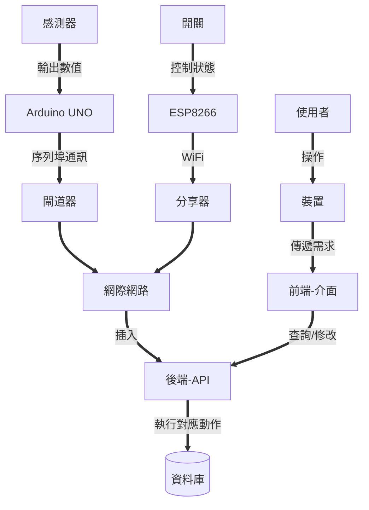

感謝您的聯繫！

無論您有什麼問題和建議，或者只是想分享您的想法，我都願意傾聽。

## 自我介绍

<div className="avatar-img">
  
</div>

- 台灣人
- 屬性
  - 真人不實體出道
  - 社交+口語障礙
- INTJ-T

## 主要的SNS

請隨時透過以下任何方式與我取得聯繫：

- [GitHub](https://github.com/neko0xff)
- Email
  - [Gmail](mailto:chzang55@gmail.com)
  - [Proton](mailto:neko0xff@protonmail.com)
- [X/Twitter](https://twitter.com/neko_0xFF)
- [YouTube](https://www.youtube.com/channel/UCfBR43eCo07mPWN6K-97TEA)
- [Instagram](https://www.instagram.com/neko_0xff/)
- [Linkdin](https://www.linkedin.com/in/%E5%B1%95%E9%8A%98-%E8%A8%B1-823b41183/)

## 曾摸過的項目

- 開發板
  - Arduino
    - UNO,Nano(atmega)
    - ESP8266/32
  - 8X51
- 前端
  - Flutter
  - Astro.js(React)
- 後端
  - Nodejs
- DataBase
  - MariaDB(MySQL)
  - M$-SQLServer

## Side Project

- Blog

  - 組成架構
    - 框架: [Astro](https://docs.astro.build/zh-tw/concepts/why-astro/)
    - 主題: [astro-paper](https://github.com/satnaing/astro-paper)
    - PaaS: [Deno Deploy](https://deno.com/deploy)

- 111專題: 空氣感測+本地SaaS
  - [後端+硬體:Arduino+Nodejs+MariaDB](https://github.com/neko0xff/2023_schoolResearch_Server-HW)
  - [前端:Flutter](https://github.com/neko0xff/2023_schoolResearch_ClientApp)
  - 流程圖



- MessageBot
  - Line
    - [後端:Nodejs](https://github.com/neko0xff/2023_LineBot_Node)
  - Telegram
    - [後端:Nodejs](https://github.com/neko0xff/2021_telegram_chatbot)

## 如何加入友站鏈結

1. 向該站管理者私信或者提出Issues到`neko0xff/blog_astroV2`
   - 相關倉庫: https://github.com/neko0xff/blog_astroV2
2. 加入的格式如下
   - 由於前端框架己用Astro重寫，請用JSON格式進行提交
   - 相關文件: `public/assets/myLinks.json`

```json
{
   "name": "neko0xff",
   "site": "Neko0xff Tech Blog",
   "siteURL": "https://neko0xff.github.io/",
   "icon": "https://avatars.githubusercontent.com/u/54382007?v=4"
},
```

3. 管理員收到後，會自己加入提出者的友站鏈結

<div>
  
</div>
