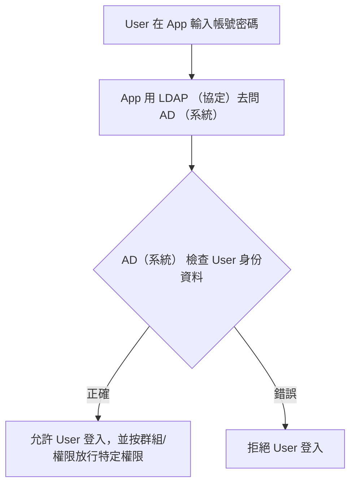

## Why: 主要解決問題

- 公司內部有多套系統&裝置，若每套都各自存下每位使用者的帳戶密碼，則會造成：
  * 密碼散落各處且無法統一密碼使用政策
  * 權限控管散亂，任何一個人皆可看見不該看的機密資料或不該動的設定
  * 離職員工帳號難以一次停用,得必須自行手動停用

## How: 主要整合的核心機制-集中式身份驗證

- 身份處理
  * 所有應用程式的登入與權限判斷，皆會委託給公司架設的 LDAP (Lightweight Directory Access Protocol) 或 Active Directory (AD) 統一集中處理
  * 同時實現使用者資料、群組權限的完整帳號生命週期管理
- 驗證邏輯
  * 應用程式/裝置無需自行驗證帳號密碼的正確性，而是直接將驗證請求交給中央伺服器進行統一集中驗證判斷
- 結果導向
  1. 使用者的身份驗證成功後，該中央系統會回傳該使用者的身份資訊給應用程式/裝置
  2. 應用程式/裝置會接著根據所回傳的身份或群組資料，而決定該使用者應該獲得什麼角色與存取操作權限

## Who: 常見場景

- 登入受企業管理的電腦裝置進行日常工作
- 在外部網路環境下，使用 VPN 連線且登入至公司內部的網路服務
- 管控特定群組或者使用者，是否能存取讀寫某些檔案和軟體安裝的權限

## LDAP ！= AD (不同之處) 

- LDAP(Lightweight Directory Access Protocol)：一個開放式的、輕量級的標準通訊協議
    * 功能(What)：定義了應用程式
        * 如何向身份目錄發出查詢
            * ex：「這個使用者存在嗎？」
        * 如何應對目錄服務的回覆
            * ex：「對，他在這個群組裡」
    * 優勢(Why)：因為它是開放式的，所以它可以讓任何跨平台（不管 OS 屬 Windows、Linux 還是 Mac）的應用程式都能夠理解和與這個目錄進行交流。
    * 關注點(How) 
        * 「如何溝通」
-  AD(Active Directory)：針對微軟 Windows 環境，而設計的集成的身份管理系統
    * 功能(What)：包含了使用者資料、群組權限、登入驗證機制、安全政策等所有細節。
    * 優勢(Why)：AD 的核心功能是基於 LDAP 演變而來，然後將這些通訊與更複雜的身份管理邏輯、安全性、網域管理功能整合在一起，提供給企業內部的完整解決方案。
    * 關注點(How)
        * 「管理什麼」 
        * 「如何運作的全部流程」

## 總結

| 概念 | 比喻                                                       | 核心功能                                                                           | 運作重點                                                             |
|:----:|:---------------------------------------------------------- |:---------------------------------------------------------------------------------- |:-------------------------------------------------------------------- |
| LDAP | 共通的溝通語言（例如：英語、中文的通用語法）               | 提供介面：定義了系統如何「問問題」和「回覆答案」的基礎語法和規則。                 | 【分散式/互通性】：讓不同背景（Windows/Linux）的系統能夠理解和交流。 |
|  AD  | 應用這套規則的完整工具箱（例如：一個完整的辦公室後台系統） | 提供實施層：在通用規則之上，整合了「存檔、權限、安全」等所有複雜的完整的管理功能。 | 【集中式/統整性】：提供高度集中、統一的安全性與企業級管理體驗。      |

## REF
- [什麼是 LDAP 認證？-Fortinet](https://www.fortinet.com/tw/resources/cyberglossary/ldap-authentication)
- [ldap-vs-active-directory-Okta](https://www.okta.com/identity-101/ldap-vs-active-directory/)
