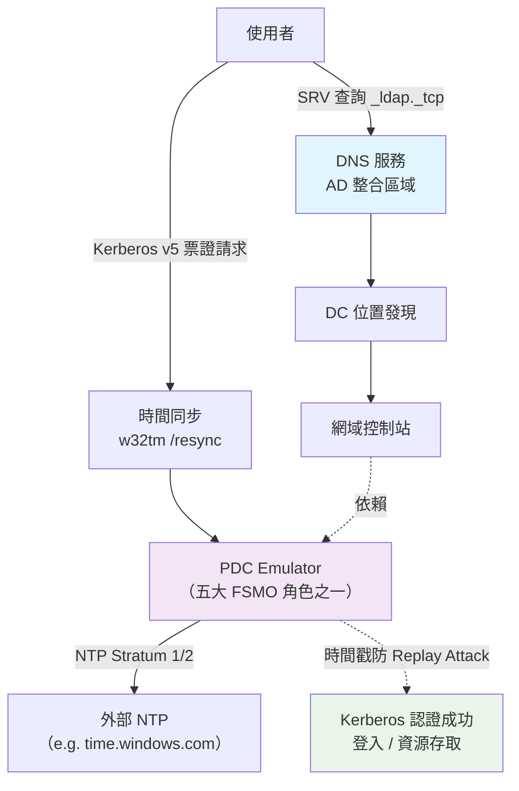

## 前置流程

- 在部署網域控制站(DC,Domain controller)時
  - 應將 Windows Time 服務 (NTP Server) 設定為「自動 (Automatic)」，以確保全網域的時間基準保持一致
  - 相關服務必須指向正確 DNS 伺服器,且不可隨意修改 DC DNS 本身設定
- 在電腦/伺服器加入網域前，得先確認
  - 該部電腦的網路設定的 DNS Server 是否指向 DC 的 IP 位置
  - 是否有建立本機的管理員帳戶，方便後續在網域服務失效時管理
    - 同時建議停用本機上的 `Administrator` 帳戶， 只因該帳戶等同 Linux 的 `root` (最高權限管理者)
  - 所使用的
    - 系統版本是否能讓網域納管
      - 主要決定在網域控制站上的服務功能等級
    - 版本授權部分，是否支援加入網域
      - 對"使用者"端 (Windows):
        - 支援： Windows xx 專業/企業/教育版
        - 不支援：家用版完全不支援
      - 對"伺服器"端 (Windows Server): 所有版本(同時支援做網域控制站)

<!--more-->

## 網域服務為何依賴 DNS 解析 & 時間的準確性

- 時間準確性
  - 網域控制站上 PDC Emulator 角色則扮演了 "時間來源" 的核心位置
  - 使用到的相關技術: Kerberos
    - 用來在非安全網路環境中，針對個人通訊以安全的手段進行身分認證
    - 使用時間戳記來防止重送攻擊 (Replay Attack),故需要把時間進行正確同步
    - 若時鐘準確性偏差歪斜過大，驗證部分將會失敗
      - 容許範圍： 5 min == 300 sec
- DNS 解析部分
  - 在主機名稱與 DNS 管理工具中，會同時顯示其 NetBIOS 與 FQDN 兩種表示法
  - 當 DNS 服務上的記錄查詢 (SRV Record，`_ldap._tcp.dc._msdcs.<domain>`) 發生錯誤時，會造成使用者登入&資源存取部分出現問題



## 命名與識別

### 電腦

- 演變：NETBIOS(Network Basic Input/Output System,網路基本輸入輸出系統) ⇒ FQDN (Fully qualified domain name,完整網域名稱)
  | 特性 | NetBIOS 名稱 | FQDN (DNS 名稱) |
  |:--------:|:----------------------------:|:----------------------:|
  | 長度限制 | 最多 15 個字元 (+1 服務字元) | 無此 15 字元限制 |
  | 結構 | 單一平面名稱 (Flat Name) | 階層式結構 (主機+網域) |
  | 解析工具 | WINS 伺服器、廣播、LMHOSTS | DNS 伺服器、HOSTS 檔 |
  | 支援協議 | 不支援 IPv6 | 現代網路標準 |
  | 格式 | `NEKOLAB` | `nekolab.local` |

- 當一部具有 NetBIOS 名稱(`server01`)的電腦,加入網域(`nekolab.local`)後
  1.  系統會自動為其加上網域尾碼，使其擁有一個對應的 FQDN （`server01.nekolab.local`)
  2.  同時 FQDN 的「主機名稱」部分，通常就會對應到該部電腦的 NetBIOS 名稱
- 電腦名稱格式與解析路徑的自動判定
  - 系統在發出查詢請求前，會先根據「名稱的外觀」來預判該走哪條路
    | 名稱特徵 | 判定類別 | 解析行為說明 |
    |:------------------:|:-------------------------:|:--------------------------------------------------------------------------:|
    | 長度 > 15 個字元 | 非 NetBIOS 名稱 | 自動轉換 DNS：直接跳過 NetBIOS 管道，僅使用 DNS 進行解析。 |
    | 包含句點 (`.`) | FQDN / DNS 名稱 | 自動轉換 DNS：判定為域名格式（如 `pc01.company.com`），直接改用 DNS 解析。 |
    | 長度 ≤ 15 且無句點 | NetBIOS 名稱（Flat Name） | 進入傳統的 NetBIOS 解析路徑（如 WINS、廣播等）。 |
- 在企業環境中最常見的 H-Node (Hybrid) 設定下
  - 系統會優先保護網路頻寬，先尋找快取與伺服器，最後才求助於廣播或 DNS
  - 解析順序
    1. NetBIOS 名稱快取 (Remote Name Cache)： 先看自己有沒有記住過
    2. WINS 伺服器查詢： 向 WINS 伺服器詢問
    3. 網路廣播 (Broadcast)： 如果 WINS 沒回應，則在本地子網發送廣播尋找
    4. LMHOSTS 檔案： 檢查本地的靜態對應表
    5. DNS 查詢： 如果上述 NetBIOS 路徑全部失敗，系統才會將該名稱加上「DNS 尾碼」轉換成 DNS 請求發送

- 檢視當前的機器加入網域情況
  - 裝置當前 IP(在 DC 上查詢)

    ```
    C:\Users\neko_admin> Get-ADComputer -Identity "PC-01" -Properties IPv4Address | Select-Object Name, IPv4Address

    Name  IPv4Address
    ----  -----------
    PC-01 192.168.57.124
    ```

  - 裝置狀態(Device State)
    - 加入網域的狀態分類
      1. `AzureAdJoined` = YES : Azure AD/Entra ID
      2. `DomainJoined` = YES : 本地 AD

  ```powershell
  PS C:\Users\neko_admin> dsregcmd /status

    +----------------------------------------------------------------------+
    | Device State                                                         |
    +----------------------------------------------------------------------+

                 AzureAdJoined : NO
              EnterpriseJoined : NO
                  DomainJoined : YES
                    DomainName : NEKOLAB
               Virtual Desktop : NOT SET
                   Device Name : WIN-ML8SV4QSBOG.nekolab.local

    +----------------------------------------------------------------------+
    | User State                                                           |
    +----------------------------------------------------------------------+

                        NgcSet : NO
               WorkplaceJoined : NO
                 WamDefaultSet : ERROR (0xd0020017)

    +----------------------------------------------------------------------+
    | SSO State                                                            |
    +----------------------------------------------------------------------+

                    AzureAdPrt : NO
           AzureAdPrtAuthority : NO
                 EnterprisePrt : NO
        EnterprisePrtAuthority : NO

    +----------------------------------------------------------------------+
    | Diagnostic Data                                                      |
    +----------------------------------------------------------------------+

         Diagnostics Reference : www.microsoft.com/aadjerrors
                  User Context : UN-ELEVATED User
                   Client Time : 2026-05-10 04:18:52.000 UTC
          AD Connectivity Test : PASS
         AD Configuration Test : FAIL [0x80070002]
            DRS Discovery Test : SKIPPED
         DRS Connectivity Test : SKIPPED
          Kerberos Ticket Test : SKIPPED
        Token acquisition Test : SKIPPED
         Fallback to Sync-Join : ENABLED
          Fallback to Fed-Join : ENABLED

         Previous Registration : 2026-05-10 03:48:42.000 UTC
                   Error Phase : discover
              Client ErrorCode : 0x801c001d
        Executing Account Name : NEKOLAB\installer, installer

    +----------------------------------------------------------------------+
    | IE Proxy Config for Current User                                     |
    +----------------------------------------------------------------------+

          Auto Detect Settings : YES
        Auto-Configuration URL :
             Proxy Server List :
             Proxy Bypass List :

    +----------------------------------------------------------------------+
    | WinHttp Default Proxy Config                                         |
    +----------------------------------------------------------------------+

                   Access Type : DIRECT

    +----------------------------------------------------------------------+
    | Ngc Prerequisite Check                                               |
    +----------------------------------------------------------------------+

                     NgcPreReq : ERROR (0xd0020017)
                IsDeviceJoined : UNKNOWN
                 IsUserAzureAD : UNKNOWN
                 PolicyEnabled : UNKNOWN
              PostLogonEnabled : UNKNOWN
                DeviceEligible : UNKNOWN
            SessionIsNotRemote : YES
                CertEnrollment : none
                  PreReqResult : WillNotProvision

    For more information, please visit https://www.microsoft.com/aadjerrors
  ```

### 使用者帳戶

- 演變：下層登入名稱 (Down-Level Logon Name) =〉 使用者主體名稱 (User Principal Name, UPN)
  | 特性 | 下層登入名稱 (Down-Level Logon Name) | 使用者主體名稱 (User Principal Name, UPN) |
  |:------------:|:---------------------------------------:|:-----------------------------------------:|
  | 命名體系 | 基於 NetBIOS | 基於 DNS |
  | 字元長度限制 | 網域部分限制為 15 個字元 | 支援較長名稱 |
  | 主要用途 | 用於回溯相容舊版 Windows 或傳統應用程式 | 直覺且與電郵外觀一致 |
  | 格式 | `NetBIOS 名稱\使用者` | `使用者@完整網域名稱` (FQDN/DNS 名稱) |
- 當使用者在己加入網域的電腦上登入時，系統會自動判斷格式
  | 名稱格式 / 特徵 | 可能的解析方式 | 行為說明 |
  |:--------------------------------:|:--------------:|:-------------------------------------------------------------------------------------------------:|
  | 單純短名稱（如 `NEKOLAB`）+ `/`` |  NetBIOS 解析  |                 系統可能優先嘗試傳統 NetBIOS 名稱解析（如 WINS、廣播、LMHOSTS）。                 |
  |       名稱中包含 `@`符號        | DNS / UPN 解析 | 常見於 UPN 格式（如`user@nekolab.local`），系統通常會改走 DNS 與 Active Directory 網域定位流程。 |

## 針對不同格式的主要定義

- 無論使用者輸入哪種格式來進行認証，在 Active Directory 的底層，都是在處理同一個安全性主體 (Security Principal)
  - 主要權限的授與是綁定在 SID（Security Identifier,安全識別碼） 上，而非登入名稱的字串本身
    - 在 Windows 上是獨一無二的存在，且可視為 "身份証字號" 的存在
    - 主要用來記錄物件（使用者帳戶、群組、電腦）的權限與操作，方便進行管理
    - 格式: `(SID)-(版本級別)-(標識符授權)-(子授權1)-(子授權2)-(等等)`
    - 如何查詢
      1. 當前使用者

      ```powershell
      C:\Users\neko_admin> whoami /user

        USER INFORMATION
        ----------------

        使用者名稱                SID
        ========================= ============================================
        win-015bk295136\installer S-1-5-21-422317100-3408024488-320855090-1000
      ```

      2. 本機使用者

         ```powershell
         C:\Users\neko_admin> Get-LocalUser | Select-Object Name, SID

          Name               SID
          ----               ---
          Administrator      S-1-5-21-422317100-3408024488-320855090-500
          DefaultAccount     S-1-5-21-422317100-3408024488-320855090-503
          Guest              S-1-5-21-422317100-3408024488-320855090-501
          installer          S-1-5-21-422317100-3408024488-320855090-1000
          WDAGUtilityAccount S-1-5-21-422317100-3408024488-320855090-504
         ```

  - 在網域服務中，電腦帳號屬於安全性主體，能作為網域資源存取控制的對象。
    - 不建議讓電腦帳號長期停留在預設的 Computers 容器
      - 應依管理與安全需求移入適當的 OU，才能正確套用 GPO 並進行委派管理
    - 預設的 Computers 容器並非 OU，故無法直接對其套用 GPO。
      - 為確保原則控管與權限分派之可管理性，建議建立具體且清楚的 OU 結構，並將電腦帳號依角色、部門或管理範圍進行分類配置

## 絕對不能做

- 重建網域控制站並建立全新網域
  | 影響項目 | 原因 | 後果 |
  |:-----------------:|:-------------------------------------------------------------------------------- |:----------------------------------------------------- |
  | Domain SID | 網域重建時會建立新的安全識別碼（Security Identifier） | 所有依賴舊 SID 的權限設定失效 |
  | NTFS ACL 權限 | NTFS 權限儲存的是 SID\\許可權，新網域 SID 不同，舊 ACL 無法比對 | 資料夾/檔案的存取控制完全失效，使用者無法存取原有資源 |
  | GPO 安全篩選 | GPO 的安全篩選基於網域 SID 與物件 SID，新網域 SID 改變後無法匹配 | 組策略無法套用，安全設定、軟體部署等全部失效 |
  | Entra ID 帳號整合 | Entra ID 與本地 AD 的帳戶透過 SID 歷史記錄或 objectGUID 關聯，重建後這些關聯斷裂 | 大規模存取權限遺失，使用者需重新授予權限 |

## 遇到問題統整

- 在服務驗証時，容易發生情況
  1.  使用者從外部透過 VPN 連回公司內部時： 若解析路徑未能優先導向內部 DNS 服務，將導致系統無法完成身分驗證程序
  2.  當該部機器己久未上線在網域時： 若電腦系統上的時間服務部分未能和網域控制站同步一致時，將會導致電腦的網路身份授權驗証被視為無效或過期，進而引發登入問題或者內部資源存取失敗
- 如何預防問題發生
  | 預防措施 | 主要目標 |
  |:------------------:|:----------------------------:|
  | 定期備份網域控制站 | 方便災難復原 |
  | 校對系統時間同步 | 確保時間偏差 < 5 分鐘 |
  | 部署多台 DC 備援 | 分散該網域的五大角色，避免單點故障 |

## REF

### Microsoft Learn

- [Windows 中的 Active Directory FSMO 角色](https://learn.microsoft.com/zh-tw/troubleshoot/windows-server/active-directory/fsmo-roles#pdc-emulator-fsmo-role)
- [Active Directory 網域服務-功能等級](https://learn.microsoft.com/zh-tw/windows-server/identity/ad-ds/active-directory-functional-levels)
- [安全原則](https://learn.microsoft.com/zh-tw/windows-server/identity/ad-ds/manage/understand-security-principals)
- [Repadmin -replsummary](<https://learn.microsoft.com/en-us/previous-versions/windows/it-pro/windows-server-2012-r2-and-2012/cc835092(v=ws.11)>)
- [Diagnose AD replication failures - Windows Server](https://learn.microsoft.com/en-us/troubleshoot/windows-server/active-directory/diagnose-replication-failures)
- [診斷 Active Directory 複寫失敗 - Windows Server](https://learn.microsoft.com/zh-tw/troubleshoot/windows-server/active-directory/diagnose-replication-failures)
- [Transfer or seize Operation Master roles - Windows Server](https://learn.microsoft.com/en-us/troubleshoot/windows-server/active-directory/transfer-or-seize-operation-master-roles-in-ad-ds)
- [AD Forest Recovery - Seizing an Operations Master Role](https://learn.microsoft.com/en-us/windows-server/identity/ad-ds/manage/forest-recovery-guide/ad-forest-recovery-seizing-operation-master-role)

### Other

- [Kerberos - 網路身分驗證協定-CodeingMan.cc](https://codingman.cc/kerberos-authentication-protocol/)
- [Question on FSMO roles and general network issues when PDC is down for more than a couple minutes](https://www.reddit.com/r/activedirectory/comments/17erd93/question_on_fsmo_roles_and_general_network_issues/)
- [Ｗindows Security - 簡介 SID 安全識別碼 、ACE、UAC等](https://ithelp.ithome.com.tw/articles/10365635)
